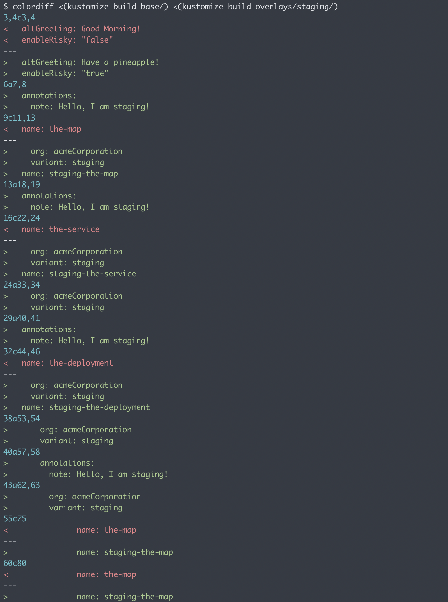
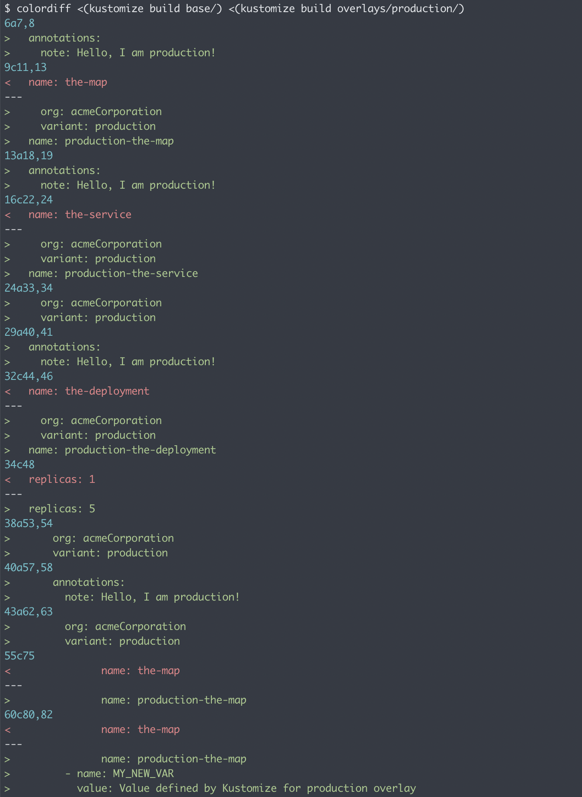
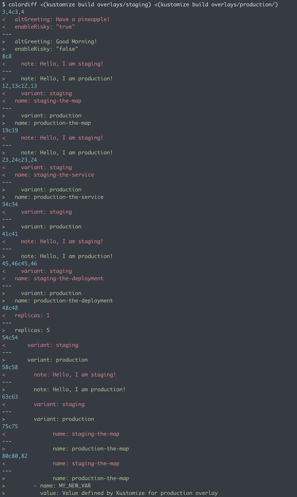

# Kustomize Example

The intention of this repo is to showcase some of the capabilities of Kustomize. I have adapted one of the examples from the Kustomize Github repo; the rest can be found here: https://github.com/kubernetes-sigs/kustomize/tree/master/examples

## Bases vs Overlays

### Bases

When you run `kustomize` the "base" is loaded into memory and if any "overlays" exist that match they are merged over top of your "base" configuration. The "base" is the core module which defines the container infrastructure and their properties.

In this example, my base consists solely of the "hello" Golang application and Kubernetes objects for deployment, service, and configmap.

```
base
├── hello
│   ├── configMap.yaml
│   ├── deployment.yaml
│   ├── kustomization.yaml
│   └── service.yaml
└── kustomization.yaml
```

I could deploy this as-is to a cluster by running `kustomize build base | kubectl apply -f -`, but I would miss out on being able to make minor adjustments to account for variances between environments. Maybe you want labels to reflect the environment it's running in; maybe things should be in a different namespace; maybe you want different environment variables or secrets.

Enter overlays.

### Overlays

Overlays are where you can make those minor adjustments that build upon the base. In this example I've setup overlays for each environment, though I've seen them used for particular clusters or namespaces; use it however makes the most sense.

```
overlays
├── production
│   ├── deployment.yaml
│   └── kustomization.yaml
└── staging
    ├── kustomization.yaml
    └── map.yaml
```

#### Staging

For the [staging overlay](overlays/staging/kustomization.yaml) I'm adjusting the labels and annotations to reflect the staging environment. Also, I'm using a different configmap for the "hello" application whch is referenced in the base deployment; this will reflect in the output when reaching the service at the load balancer via HTTP.

Now I can apply staging specific resources to my cluster by running `kustomize build overlays/staging | kubectl apply -f -`. Compare the diffs between the rendered base and rendered staging overlay:



#### Production

For the [production overlay](overlays/production/kustomization.yaml) I'm adjusting the labels and annotations as well as bumping deployment replicas and injecting a new environment variable.

Apply it with `kustomize build overlays/production | kubectl apply -f -`. Now compare the diffs between rendered base and rendered production overlay:



#### Staging vs Production

Finally, comparing diffs between staging and production helps to see the differences between them.



# Further Reading

I found these links helpful in my evaluation of tooling which ultimately lead to my recommendations:

* :fire: https://stackoverflow.com/questions/60519939/what-is-the-difference-between-helm-and-kustomize
* :fire: https://argoproj.github.io/argo-cd/user-guide/best_practices/
* https://foghornconsulting.com/2020/06/04/helm-versus-kustomize/#:~:text=To%20boil%20it%20all%20down,anything%20in%20a%20Kubernetes%20manifest
* https://medium.com/@alexander.hungenberg/helm-vs-kustomize-how-to-deploy-your-applications-in-2020-67f4d104da69
* https://luktom.net/en/e1683-argocd-vs-flux#:~:text=The%20basic%20features%20are%20the,git%20repositories%20to%20one%20cluster
* https://blog.container-solutions.com/fluxcd-argocd-or-jenkins-x-which-is-the-right-gitops-tool-for-you
